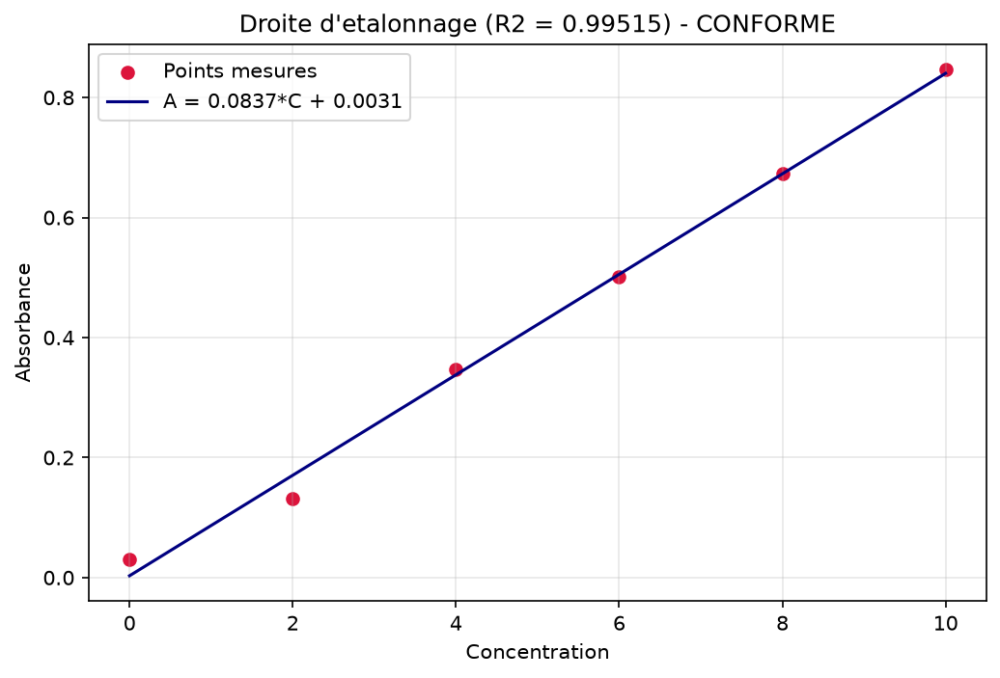

# Outil de validation de gamme d'étalonnage 🧪📈

Un outil Python qui **automatise la validation d'une méthode analytique linéaire**
(spectrophotométrie, chromatographie…) à partir d'une gamme d'étalonnage.

Conçu par un **technicien en chimie analytique** pour remplacer le traitement manuel
sous tableur : ce qui prend des heures et comporte des risques d'erreur de recopie
se fait en quelques secondes, de façon reproductible.

---

## Le problème

Dans un laboratoire, valider une droite d'étalonnage se fait souvent à la main dans
Excel : saisie des points, tracé, calcul du R², de la LOD, de la LOQ, puis mise en
forme d'un rapport. C'est **long, répétitif et source d'erreurs**, alors que c'est
une opération réglementée (linéarité, limites de détection/quantification).

## La solution

À partir des concentrations et des réponses mesurées, l'outil calcule
automatiquement :

- la **régression linéaire** (pente et ordonnée à l'origine) ;
- le **coefficient de détermination R²** (critère de linéarité) ;
- la **LOD** (limite de détection) et la **LOQ** (limite de quantification), selon
  l'approche ICH `LOD = 3.3·σ/pente`, `LOQ = 10·σ/pente` ;
- un **verdict de conformité** automatique (CONFORME / NON CONFORME) ;
- un **graphique** de la gamme avec la droite ajustée.

## Exemple de résultat

```
----- RAPPORT DE VALIDATION : Gamme de demonstration -----
  Droite     : A = 0.1170 * C + 0.0075
  R2         : 0.99765
  LOD        : 0.547
  LOQ        : 1.659
  VERDICT    : CONFORME
```



## Utilisation

```python
from validation_gamme import valider_gamme, afficher_rapport

concentrations = [0, 2, 4, 6, 8, 10]
absorbances    = [0.01, 0.24, 0.47, 0.70, 0.92, 1.17]

rapport = valider_gamme(concentrations, absorbances)
afficher_rapport("Ma gamme", rapport)
```

Lancer la démonstration intégrée (données synthétiques) :

```bash
python validation_gamme.py
```

Ou valider **ton propre fichier CSV** (2 colonnes : `concentration`, `absorbance`) :

```bash
python validation_gamme.py gamme.csv
```

## Note sur les données

Toutes les données utilisées sont **100 % synthétiques** (générées aléatoirement) :
aucune donnée réelle de laboratoire n'est utilisée ni diffusée.

## Installation

```bash
python -m pip install -r requirements.txt
```

## Améliorations prévues

- Écart-type résiduel rigoureux à `n-2` degrés de liberté
- ~~Import direct depuis un fichier CSV~~ ✅ fait
- Export du rapport en PDF
- Détection automatique du domaine de linéarité

---

*Projet d'apprentissage — chémométrie / data science appliquée au laboratoire.*
